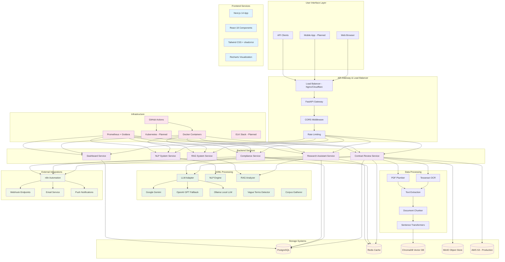
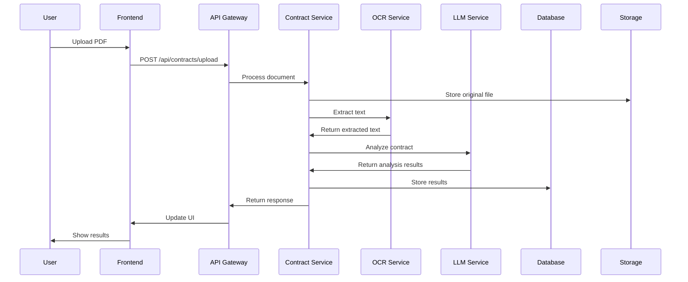
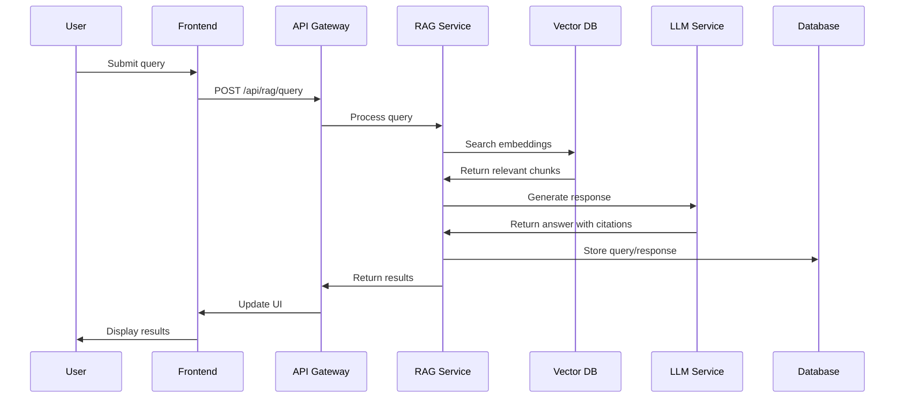

# Blackletter Systems - Complete System Architecture Audit

## Executive Summary

Blackletter Systems is an AI-powered legal document analysis platform built with a modern microservices architecture. The system provides automated contract review, risk assessment, and compliance analysis using advanced NLP, RAG (Retrieval-Augmented Generation), and LLM technologies.

**Current State**: MVP with core functionality implemented
**Architecture**: Microservices with FastAPI backend and Next.js frontend
**AI Stack**: Google Gemini LLM with OpenAI fallback, custom NLP pipelines
**Storage**: PostgreSQL, Redis, ChromaDB vector database
**Deployment**: Docker containerization with cloud-ready infrastructure

---

# Vibecode SaaS Command Prompts

Instead of plain docs, Vibecode uses **command-style .md playbooks** that act like recipes. Each command represents a repeatable step in the dev lifecycle.

---

## 🔨 New Projects
- `define_project_brief` — define a project brief (business context)
- `embed_tech_guidance` — add technical rules into `.cursorrules`
- `starter_kit` — bootstrap with `create-next-app`, `create-volo-app`, etc.

---

## 🚀 Building Features
- `plan_feature` — write a feature plan (goals, acceptance criteria, scope)
- `review_plan` — validate the plan with the team/AI reviewer
- `phase_breakdown` — split plan into actionable dev phases
- `code_review` — run automated/static/manual code review
- `read_review` — summarize the review comments
- `select_fixes` — decide which fixes to apply
- `manual_test` — test feature manually across environments
- `confirm_merge` — finalize changes and merge to main

---

## 📂 Example Command File (`plan_feature.md`)
```md
# plan_feature

## Purpose
Draft a detailed plan for `<feature>` including:
- Business goal
- Acceptance criteria
- Out of scope

## Usage
plan_feature "<feature_name>"
```

---

## 📂 Example Command File (`code_review.md`)
```md
# code_review

## Purpose
Perform multi-step review:
- Run `ruff`, `mypy`, `pytest`
- Run `npm lint`, `npm test`
- Collect AI suggestions

## Usage
code_review "<branch_name>"
```

---

This format turns your `.md` docs into a **command library** — each file is a reusable unit (like a CLI command but documented in markdown).

---

## 🏗️ System Architecture Topology



## 📊 Component Architecture Details

### 1. Frontend Layer (Next.js 14)

**Technology Stack:**
- **Framework**: Next.js 14 with App Router
- **UI Library**: React 18 with TypeScript
- **Styling**: Tailwind CSS + shadcn/ui components
- **Charts**: Recharts for data visualization
- **State Management**: React hooks and context

**Key Components:**
```
frontend/
├── app/
│   ├── dashboard/          # Main dashboard interface
│   ├── upload/            # Document upload interface
│   └── layout.tsx         # Root layout
├── components/
│   ├── blackletter-app.tsx    # Main app component
│   ├── navigation.tsx         # Navigation bar
│   ├── rag-interface.tsx      # RAG query interface
│   └── vague-terms-finder.tsx # Vague terms analysis
└── lib/
    └── utils.ts           # Utility functions
```

### 2. API Gateway Layer (FastAPI)

**Core Services:**
- **Main API**: FastAPI application with CORS and middleware
- **Routers**: Modular routing for different services
- **Authentication**: JWT-based auth (planned)
- **Rate Limiting**: Request throttling and quotas

**API Endpoints:**
```
/api/
├── /contracts/            # Contract review endpoints
├── /dashboard/            # Dashboard data endpoints
├── /rag/                  # RAG system endpoints
└── /nlp/                  # NLP system endpoints
```

### 3. Backend Services Layer

#### Contract Review Service
- **File Upload**: PDF processing and validation
- **OCR Processing**: Text extraction using Tesseract
- **Analysis Pipeline**: LLM-powered contract analysis
- **Risk Assessment**: Automated risk scoring
- **Report Generation**: Structured report creation

#### Compliance Service
- **Rule Engine**: YAML-based compliance rules
- **GDPR Checking**: Automated GDPR compliance analysis
- **Statute Validation**: Legal statute verification
- **Audit Logging**: Comprehensive compliance tracking

#### Research Assistant Service
- **RAG System**: Retrieval-augmented generation
- **Vector Search**: Semantic document search
- **Citation Management**: Paragraph-level citations
- **Knowledge Base**: Legal document corpus

#### NLP System Service
- **Text Analysis**: Sentiment, entities, keywords
- **Corpus Management**: Multi-source data collection
- **Model Management**: Dynamic model loading
- **Embedding Generation**: Vector representations

### 4. AI/ML Processing Layer

#### LLM Adapter
```python
# Supports multiple LLM providers
- Google Gemini (primary)
- OpenAI GPT (fallback)
- Ollama local models
- Custom model integration
```

#### NLP Engine
```python
# Comprehensive NLP capabilities
- Sentiment analysis
- Entity extraction
- Keyword extraction
- Topic modeling
- Text summarization
- Readability analysis
```

#### RAG System
```python
# Advanced retrieval and generation
- Document chunking
- Embedding generation
- Vector similarity search
- Context-aware responses
- Citation tracking
```

### 5. Data Processing Layer

#### OCR & Text Extraction
- **Tesseract OCR**: Image-to-text conversion
- **PDF Plumber**: PDF text extraction
- **Text Cleaning**: Normalization and preprocessing
- **Structure Analysis**: Document layout parsing

#### Document Processing
- **Chunking**: Intelligent document segmentation
- **Embedding**: Vector representation generation
- **Metadata Extraction**: Key information identification
- **Content Analysis**: Legal clause detection

### 6. Storage Layer

#### PostgreSQL Database
```sql
-- Core tables
- users                    # User management
- documents               # Document metadata
- analysis_results        # Analysis outputs
- compliance_checks       # Compliance results
- audit_logs             # System audit trail
```

#### Redis Cache
```redis
# Caching strategy
- Session storage
- Analysis results cache
- Rate limiting counters
- Job queue management
```

#### ChromaDB Vector Database
```python
# Vector storage
- Document embeddings
- Semantic search index
- Similarity matching
- Context retrieval
```

#### Object Storage
```python
# File storage
- Original documents
- Generated reports
- Analysis artifacts
- Export files
```

### 7. Infrastructure Layer

#### Containerization
```yaml
# Docker services
- backend: FastAPI application
- frontend: Next.js application
- postgres: Database
- redis: Cache and queue
- chromadb: Vector database
- minio: Object storage
```

#### Monitoring & Observability
```yaml
# Monitoring stack
- Prometheus: Metrics collection
- Grafana: Visualization
- ELK Stack: Logging (planned)
- Health checks: Service monitoring
```

## 🔄 Data Flow Architecture

### 1. Document Processing Flow



### 2. RAG Query Flow



## 🛡️ Security Architecture

### Authentication & Authorization
- **JWT Tokens**: Stateless authentication
- **Role-Based Access**: RBAC implementation
- **API Keys**: Service-to-service authentication
- **Session Management**: Redis-based sessions

### Data Protection
- **Encryption**: AES-256 for data at rest
- **TLS/SSL**: HTTPS for data in transit
- **Input Validation**: Comprehensive sanitization
- **Rate Limiting**: DDoS protection

### Compliance
- **GDPR**: Data privacy compliance
- **SOC 2**: Security controls
- **Audit Logging**: Comprehensive trails
- **Data Retention**: Automated cleanup

## 📈 Performance & Scalability

### Horizontal Scaling
- **Stateless Design**: API services are stateless
- **Load Balancing**: Multiple API instances
- **Database Sharding**: Planned for high volume
- **CDN Integration**: Global content delivery

### Caching Strategy
```python
# Multi-level caching
- Browser cache: Static assets
- CDN cache: Global content
- Redis cache: Application data
- Database cache: Query results
```

### Performance Metrics
- **Response Time**: < 200ms for API calls
- **Throughput**: 1000+ concurrent users
- **Availability**: 99.9% uptime target
- **Processing Time**: 30-60s per document

## 🔧 Development & Deployment

### Development Environment
```bash
# Local setup
docker-compose up -d
cd backend && uvicorn main:app --reload
cd frontend && npm run dev
```

### CI/CD Pipeline
```yaml
# GitHub Actions
- Code quality checks
- Automated testing
- Security scanning
- Docker builds
- Deployment automation
```

### Environment Management
```bash
# Environment variables
DATABASE_URL=postgresql://...
REDIS_URL=redis://...
LLM_PROVIDER=gemini
OPENAI_API_KEY=...
GEMINI_API_KEY=...
```

## 🚀 Future Architecture Enhancements

### Planned Improvements
1. **Kubernetes Orchestration**: Production container orchestration
2. **Service Mesh**: Istio for service-to-service communication
3. **Event Streaming**: Apache Kafka for real-time processing
4. **Advanced Analytics**: ML pipeline for insights
5. **Multi-tenancy**: SaaS platform capabilities

### Technology Roadmap
- **GraphQL**: API query optimization
- **WebSockets**: Real-time updates
- **Micro-frontends**: Modular UI architecture
- **Edge Computing**: Global performance optimization

## 📋 System Constraints & Limitations

### Current Limitations
- **File Size**: 10MB maximum per document
- **File Types**: PDF only (DOCX/TXT planned)
- **Processing Time**: 30-60 seconds per document
- **Concurrent Users**: 100+ supported

### Scalability Considerations
- **Database**: PostgreSQL scaling strategies
- **Vector DB**: ChromaDB performance optimization
- **LLM API**: Rate limiting and costs
- **Storage**: Object storage costs and performance

## 🎯 Conclusion

Blackletter Systems demonstrates a well-architected, scalable platform for AI-powered legal document analysis. The microservices architecture provides flexibility for future enhancements while maintaining performance and reliability. The integration of modern AI/ML technologies with robust infrastructure creates a solid foundation for growth and expansion.

**Key Strengths:**
- Modern, scalable architecture
- Comprehensive AI/ML integration
- Security and compliance focus
- Developer-friendly tooling
- Cloud-native design

**Areas for Enhancement:**
- Advanced monitoring and observability
- Multi-tenant architecture
- Performance optimization
- Advanced security features
- Global deployment strategy
