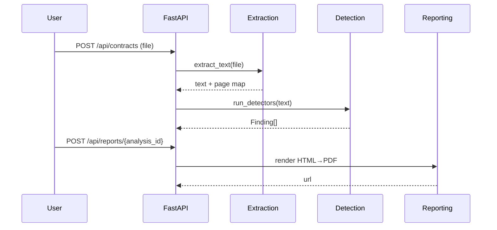

# Blackletter — Backend Architecture (MVP v1)

## 1) Summary

* **Goal**: Evidence-first GDPR Art. 28(3) checker.
* **Pattern**: Thin **FastAPI** service with modular services: extraction → detection → reporting.
* **Non-goals (MVP)**: OCR by default, RAG, multi-tenant auth beyond org-level settings.

## 2) Architecture Principles

* **Determinism first** (rules-first, LLM optional and off by default).
* **Explainability** (every finding cites a snippet + offsets).
* **Small vertical slices** (one story per PR).
* **Zero trust in inputs** (strict validation, MIME/size checks).
* **Pins & reproducibility** (version-locked dependencies per sprint).

## 3) Tech Stack (pins for MVP)

* **Python 3.11**, **FastAPI 0.111**, **Uvicorn**
* **Pydantic v2**, **SQLAlchemy 2** (SQLite dev → Postgres in Phase 2)
* **PyMuPDF** (PDF), **docx2python** (DOCX), **blingfire** (sentence split)
* **Headless Chromium** for HTML→PDF export
* Tests: **pytest**, **Playwright (E2E in web)**
* Lint/format: **ruff**, **black**

> The full version matrix lives in `docs/architecture/tech_stack.md`.

## 4) Service Decomposition

* **routers/**

  * `uploads.py` (POST /api/contracts)
  * `jobs.py` (GET /api/jobs/{id})
  * `analyses.py` (GET /api/analyses/{id}[ /findings])
  * `reports.py` (POST /api/reports/{analysis_id})
* **services/**

  * `extraction.py` (PDF/DOCX → text + page map)
  - `evidence.py` (evidence window builder ±N sentences)
  * `detection.py` (load rules; run detectors a–h; produce Finding[])
  * `reporting.py` (render HTML→PDF; export URL)
  * `metrics.py` (p95 latency, tokens/doc, explainability %)
  * `llm_gate.py` (provider off by default; snippet-only with PII redaction)
  * `tasks.py` (FastAPI BackgroundTasks MVP; Phase 2 Celery)
* **models/**

  * `schemas.py` (Pydantic models: Finding, Analysis, Job)
  * `entities.py` (ORM entities)
  * `db.py` (SQLite dev; Phase 2 Postgres)
* **rules/**

  * `art28_v1.yaml` (detectors a–h)
  * `lexicons/weak_language.yaml`
* **config**

  * `core-config.yaml` (authoritative runtime toggles)

The canonical **source tree** is tracked in `docs/architecture/source_tree.md`.

## 5) Data Model (Pydantic)

```python
class Finding(BaseModel):
    detector_id: str
    rule_id: str
    verdict: Literal["pass","weak","missing","needs_review"]
    snippet: str
    page: int
    start: int
    end: int
    rationale: str
    reviewed: bool = False
```

`Analysis(id, file_name, created_at, coverage, verdict_summary)`
`Job(id, status, analysis_id?)`

## 6) API Contracts (MVP — frozen)

* `POST /api/contracts` → `{ job_id, analysis_id, status:'queued' }`
* `GET /api/jobs/{job_id}` → job status
* `GET /api/analyses/{id}` → summary + coverage
* `GET /api/analyses/{id}/findings` → `Finding[]`
* `POST /api/reports/{analysis_id}` → `{ url }`

Full JSON shapes live in `docs/architecture/api_contracts.md`.

## 7) Key Flows (Mermaid)

**Upload → Findings → Export**



## 8) Security Architecture (MVP)

* **Uploads**: PDF/DOCX only; size limit 10MB; quarantine temp dir; checksum.
* **PII**: No snippets logged; redact before any LLM call.
* **Auth**: Minimal roles (Admin/Reviewer) in Phase 2; for MVP gate UI features behind local config.
* **Transport/At-Rest**: TLS; at-rest via platform storage/DB.
* **Secrets**: env vars; `git-secrets` in CI.
* **Audit**: settings changes, exports, role changes (Phase 2).
  Threats & controls are expanded in `docs/security_architecture.md`.

## 9) Observability & Ops

* **Logging**: structured, request IDs, no raw snippet bodies.
* **Metrics**: p50/p95 latency, tokens/doc, %LLM usage, explainability %.
* **Health**: `/healthz`, `/readyz`.
* **Config**: `core-config.yaml` logged on boot (effective values).
* **Backups**: SQLite file in dev; Postgres with backups in Phase 2.
  Details in `docs/operational_architecture.md`.

## 10) Quality Gates & Testing

* **Unit**: detectors (≥3 pos + ≥3 hard neg per rule), extraction, windower.
* **Integration**: upload→findings→export happy path.
* **E2E**: web covers drag-drop, table view, export.
* **Gold set**: scorer CLI returns Precision/Recall per detector; gates: P≥0.85 / R≥0.90.
* **Performance**: p95 ≤ 60s/doc; cost ≤ £0.10/doc.

## 11) Deployment & CI/CD

* **Envs**: dev (local), staging, prod.
* **CI**: backend (pytest), web (build + tests).
* **CD**: deploy to staging on merge to main; manual promotion; rollback via previous artifact.
  Pipeline notes in `docs/deployment_ci_cd.md`.

## 12) Evolution Roadmap (Phase 2+)

* Celery + Redis for true async; Postgres + pgvector (optional)
* SSE for live job progress
* Minimal auth → SSO; org-scoped multi-tenancy
* OCR default for scans; multilingual; expanded detector families
* OpenTelemetry traces; structured logs shipping

## 13) ADRs (initial)

1. **ADR-001: Rules-first detection w/ optional LLM** — determinism & explainability trump model recall.
2. **ADR-002: SQLite dev → Postgres phase-2** — fastest local loop; smooth migration path.
3. **ADR-003: Single service FastAPI** — simpler deploy; align with vertical story slices.
4. **ADR-004: HTML→PDF export via headless Chromium** — consistent fonts, deterministic output.
