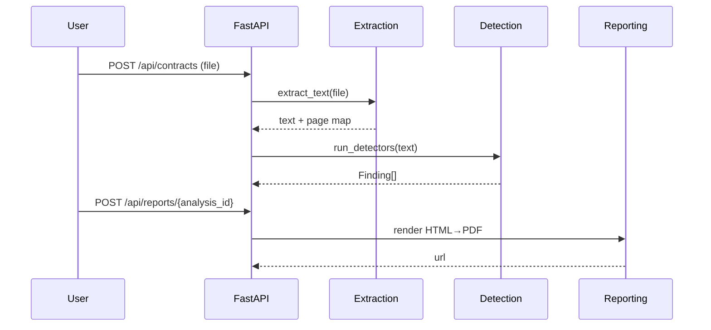

# 7) Key Flows (Mermaid)

**Upload → Findings → Export**

```mermaid
sequenceDiagram
  participant U as User
  participant A as FastAPI
  participant X as Extraction
  participant D as Detection
  participant R as Reporting

  U->>A: POST /api/contracts (file)
  A->>X: extract_text(file)
  X-->>A: text + page map
  A->>D: run_detectors(text)
  D-->>A: Finding[]
  U->>A: POST /api/reports/{analysis_id}
  A->>R: render HTML→PDF
  R-->>A: url
```
