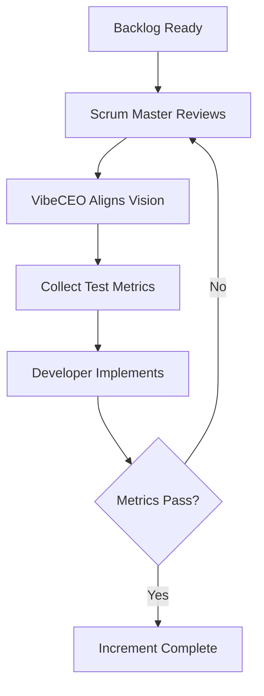

# Dev Cycle Workflow

This document describes an iterative development cycle driven by the Scrum Master. The cycle routes work through a VibeCEO checkpoint, gathers testing metrics, and returns to the developer until quality gates pass.

## Roles

1. **Scrum Master** – facilitates the cycle and prioritizes work.
2. **VibeCEO** – clarifies vision, sets tone, and approves scope before development proceeds.
3. **QA Analyst** – collects and reports test metrics to measure progress.
4. **Developer** – implements changes and addresses feedback.

## Workflow Overview

## Iteration Loop

1. **Scrum Master Review** – selects a backlog item and confirms priority with the VibeCEO.
2. **Vision Alignment** – VibeCEO ensures the task matches product direction and communicates success vibe.
3. **Metric Collection** – QA defines or updates test metrics required for acceptance.
4. **Development** – developer codes against the metrics, running tests locally.
5. **Evaluation** – metrics are reviewed; failing metrics send the cycle back to the Scrum Master for re‑prioritization and clarification.

## Termination Criteria

The loop ends when the developer's implementation satisfies all test metrics and the VibeCEO confirms alignment. The increment is then ready for integration or release.

## Deliverables

- Updated test metric report
- Implemented code meeting acceptance metrics
- Sign-off from Scrum Master and VibeCEO

