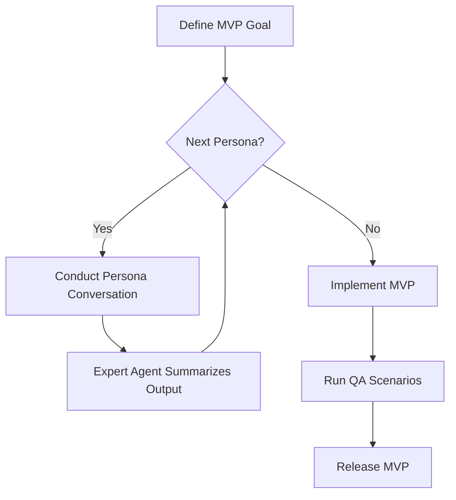

# Expert Agent Recursive Persona Workflow

This document outlines a conversational workflow for developing a Minimum Viable Product (MVP) using an expert orchestrator agent. The orchestrator iterates through domain personas, capturing their insights until the MVP criteria are satisfied.

## Personas

The workflow models the following personas:

1. **Product Owner** – defines user value and acceptance criteria.
2. **Architect** – specifies system structure and integration points.
3. **UX Designer** – sketches user journeys and interface elements.
4. **Developer** – estimates effort and surfaces technical constraints.
5. **QA Engineer** – proposes validation scenarios and test cases.
6. **Release Manager** – ensures deployment and rollback strategies.

## Workflow Overview

## Conversation Loop

For each persona, the expert agent runs a structured loop:

1. **Prompt** – the orchestrator explains the current MVP goal and asks persona-specific questions.
2. **Dialogue** – the persona responds; the orchestrator may ask follow-ups to clarify assumptions or fill gaps.
3. **Summary** – once the persona's requirements are clear, the orchestrator records the decisions and adds them to the shared backlog.
4. **Recursion** – the orchestrator proceeds to the next persona, using prior outputs as context.

## Termination Criteria

The recursion ends when every persona signs off on their domain concerns and the backlog contains:

- User stories with acceptance criteria
- Architecture diagrams or decisions
- UI sketches or component descriptions
- Implementation tasks with estimates
- Test cases
- Release checklist

## Implementation Notes

- The conversation history forms the audit trail; store it in version control for transparency.
- The expert agent should surface conflicts between personas and prompt resolution before moving on.
- When new information arises, the agent may revisit previous personas to refine deliverables, ensuring MVP coherence.

## Deliverables

The final output after completing the workflow includes:

- Consolidated backlog or requirements document
- Architecture and design artifacts
- Test plan and release strategy
- A minimal yet functional product meeting agreed goals

